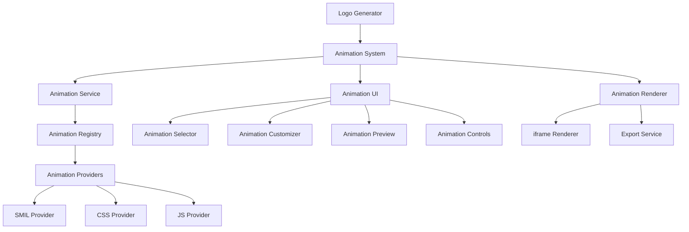
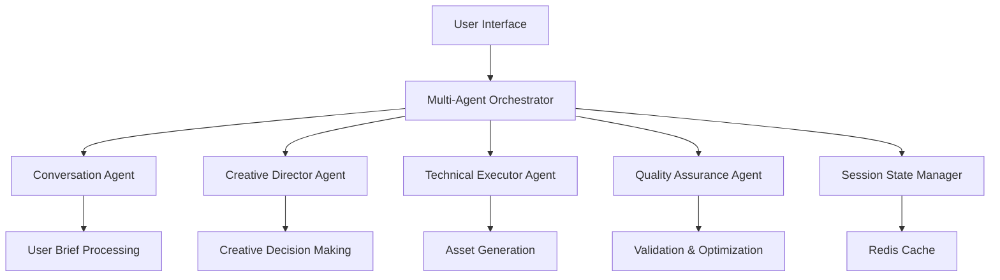

# Future Development Roadmap

## AI Logo Generator: Comprehensive Development & Enhancement Plan

This document outlines the complete development roadmap for the AI Logo Generator platform, including major feature releases, architectural improvements, and dependency updates. It serves as a central reference for planning and prioritizing development efforts.

## Table of Contents

1. [Dependency & Architecture Audit](#dependency--architecture-audit)
2. [Core Platform Enhancements](#core-platform-enhancements)
   - [Animated Logo System](#animated-logo-system)
   - [Advanced UI/UX Improvements](#advanced-uiux-improvements)
   - [Multi-Agent Orchestration](#multi-agent-orchestration)
3. [Phase 2: Brand Ecosystem Platform](#phase-2-brand-ecosystem-platform)
4. [Phase 3: Autonomous Creative Agency](#phase-3-autonomous-creative-agency)
5. [Implementation Timeline](#implementation-timeline)
6. [Appendix: Technical Specifications](#appendix-technical-specifications)

---

## Dependency & Architecture Audit

### Core Dependencies Assessment

| Package           | Current Version | Latest Version | Status          | Risk Level | Notes                             |
| ----------------- | --------------- | -------------- | --------------- | ---------- | --------------------------------- |
| next              | 15.3.3          | 15.3.3         | ✅ Up to date   | Low        | Core framework, regularly updated |
| react             | 19.0.0          | 19.0.0         | ✅ Up to date   | Low        | Core UI library                   |
| react-dom         | 19.0.0          | 19.0.0         | ✅ Up to date   | Low        | DOM rendering for React           |
| @anthropic-ai/sdk | 0.54.0          | 0.55.0         | ⚠️ Minor update | Low        | AI provider SDK                   |
| @ai-sdk/anthropic | 1.2.12          | 1.3.0          | ⚠️ Minor update | Low        | AI integration helpers            |
| ai                | 4.3.16          | 4.3.16         | ✅ Up to date   | Low        | AI utilities                      |
| sharp             | 0.34.2          | 0.34.2         | ✅ Up to date   | Low        | Image processing                  |
| svgo              | 3.3.2           | 3.3.2          | ✅ Up to date   | Low        | SVG optimization                  |
| jszip             | 3.10.1          | 3.10.1         | ✅ Up to date   | Low        | ZIP file creation                 |

### Architecture Improvement Recommendations

1. **State Management Overhaul**:

   - **Issue**: Mix of React context and prop drilling for state management
   - **Recommendation**: Implement consistent state management with Zustand
   - **Timeline**: Q3 2025
   - **Priority**: Medium

2. **Animation System Architecture**:

   - **Issue**: Current animation implementation is basic and isolated
   - **Recommendation**: Implement dedicated animation system with standardized interfaces
   - **Timeline**: Q2-Q3 2025
   - **Priority**: High
   - **Status**: Implementation planning complete

3. **Error Handling Consolidation**:

   - **Issue**: Inconsistent error handling across components
   - **Recommendation**: Implement centralized error handling system with retry mechanisms
   - **Timeline**: Q3 2025
   - **Priority**: Medium

4. **Testing Coverage Expansion**:

   - **Issue**: Incomplete test coverage for UI components and animations
   - **Recommendation**: Expand test coverage with specific focus on animation components
   - **Timeline**: Ongoing
   - **Priority**: Medium

5. **Build Performance Optimization**:
   - **Issue**: Build times could be optimized further
   - **Recommendation**: Implement module/component lazy loading, optimize bundle size
   - **Timeline**: Q4 2025
   - **Priority**: Low

---

## Core Platform Enhancements

### Animated Logo System

**Overview**: Implement a comprehensive SVG animation system that enables users to create animated versions of their logos for digital applications.

#### Architecture



#### Component Breakdown

1. **Animation Service**

   - Central coordination point for applying animations to SVGs
   - Manages animation application, validation, and optimization
   - Provides API for animation manipulation

2. **Animation Registry**

   - Maintains catalog of available animations and providers
   - Enables dynamic loading of animation providers
   - Handles fallbacks for unsupported animations

3. **Animation Providers**

   - Implements technology-specific animation logic (SMIL, CSS, JS)
   - Generates necessary code for animations
   - Handles browser compatibility concerns

4. **Animation Renderer**

   - Displays animated SVGs in controlled, isolated environment
   - Handles animation playback controls
   - Provides preview and export capabilities

5. **Animation UI Components**
   - Selection interface for animation types
   - Customization controls for animation parameters
   - Preview window with playback controls

#### Technical Implementation

**Animation Types**:

- Basic: Fade, Scale, Rotate, Translate, Path Draw, Color Transition
- Composite: Logo Reveal, Pulse, Bounce, Spin, Wave, Morph
- Interactive: Hover Effects, Click Reactions, Scroll-Triggered, Cursor-Following

**Performance Optimizations**:

- SVG element reduction before animation
- Preferred use of CSS transforms (GPU-accelerated)
- Optimized rendering with requestAnimationFrame
- Animation throttling for complex animations

**Security Considerations**:

- SVG sanitization to remove XSS vectors
- Iframe sandboxing with appropriate restrictions
- Strict Content Security Policy implementation

#### Implementation Plan

1. **Phase 1: Foundation** (4 weeks)

   - Create core interfaces and types
   - Implement basic service and registry
   - Develop simple SMIL and CSS providers

2. **Phase 2: Core Features** (6 weeks)

   - Complete all provider implementations
   - Develop UI components for selection and customization
   - Integrate with existing logo generation pipeline

3. **Phase 3: Enhanced Features** (8 weeks)

   - Implement advanced animation types
   - Add UI refinements and customization options
   - Optimize performance for complex animations

4. **Phase 4: Production Release** (4 weeks)
   - Conduct cross-browser testing
   - Complete documentation
   - Final performance tuning

### Advanced UI/UX Improvements

**Overview**: Enhance the user interface with a monochrome + #ff4233 accent design system that implements asymmetric design principles for a distinctive, modern aesthetic.

#### Design System Specifications

**Color Palette**:

- Base: #000000 (black)
- Secondary: #0F0F0F, #1A1A1A
- Lines: #333333 (default), #666666 (inactive)
- Text: #FFFFFF (primary), #AAAAAA (secondary)
- Accent: #FF4233 (red)

**Typography**:

- Headings: Raleway (200 weight) with +5-10% letter-spacing
- Body: Arimo (12px base size, 24px headings)

**Design Principles**:

- Asymmetric balance with off-center focal points
- Deliberate irregularity in layout and spacing
- Negative space as an active design element
- Hair-thin 0.5px borders where supported

#### Implementation Plan

1. **Phase 1: Design System Foundation** (3 weeks)

   - Update color system in Tailwind config
   - Implement typography system with custom fonts
   - Create asymmetric utility classes

2. **Phase 2: Component Refactoring** (4 weeks)

   - Update Button, Badge, and Card components
   - Refactor Header component with asymmetric design
   - Apply new design system to all UI elements

3. **Phase 3: Testing & Quality Assurance** (2 weeks)
   - Implement visual regression testing
   - Add accessibility testing
   - Set up Lighthouse performance budgets

### Multi-Agent Orchestration

**Overview**: Transform the current pipeline-based architecture into a multi-agent system with specialized AI models for different aspects of the logo generation process.

#### Architecture



#### Agent Specifications

1. **Conversation Agent**

   - Model: Claude 3.5 Haiku
   - Purpose: Natural language understanding and user guidance
   - Responsibilities: Extract requirements, ask clarifying questions, maintain conversation context

2. **Creative Director Agent**

   - Model: Claude 3.5 Sonnet
   - Purpose: Style and creative decisions
   - Responsibilities: Mood board creation, concept selection, style guidance

3. **Technical Executor Agent**

   - Model: Claude 3.5 Sonnet
   - Purpose: Asset generation and processing
   - Responsibilities: SVG generation, variant creation, animation application

4. **Quality Assurance Agent**
   - Model: Claude 3.5 Haiku
   - Purpose: Validation and optimization
   - Responsibilities: SVG validation, accessibility checking, optimization

#### Implementation Plan

1. **Phase 1: Architecture Design** (4 weeks)

   - Design agent communication protocols
   - Define agent responsibilities and interfaces
   - Create session state management system

2. **Phase 2: Core Agent Implementation** (8 weeks)

   - Implement conversation and creative director agents
   - Develop technical executor agent
   - Create quality assurance agent

3. **Phase 3: Orchestration System** (6 weeks)

   - Build multi-agent orchestrator
   - Implement state management with Redis
   - Create fallback mechanisms for reliability

4. **Phase 4: Testing & Optimization** (4 weeks)
   - End-to-end testing of multi-agent system
   - Performance optimization
   - Scalability testing

---

## Phase 2: Brand Ecosystem Platform

**Theme**: Expand from logo generation to comprehensive brand ecosystem creation

### Key Features

1. **Conversational Brand Discovery Engine**

   - Natural language interface with zero forms
   - AI-driven strategic brand questioning
   - Context-aware multi-turn reasoning

2. **Multi-Modal Asset Generation Platform**

   - Logo variations (primary, simplified, monogram, wordmark)
   - Social media assets (profile pics, covers, post templates)
   - Business collateral (business cards, letterhead, envelopes)
   - Digital assets (favicons, app icons, email signatures)

3. **Advanced Creative Intelligence System**

   - Style learning from reference images
   - Design trend incorporation
   - Visual cohesion maintenance

4. **Web Design Generation Engine**
   - Award-winning website research and analysis
   - Design element extraction and synthesis
   - Responsive HTML/CSS/JS code generation

### Implementation Plan

1. **Discovery Phase** (6 weeks)

   - Market research and competitor analysis
   - Technical feasibility assessment
   - User needs validation

2. **Development Phase** (16 weeks)

   - Multi-agent architecture implementation
   - Asset generation pipeline development
   - UI/UX design and implementation

3. **Testing Phase** (4 weeks)

   - Alpha testing with internal users
   - Beta testing with select customers
   - Performance and security testing

4. **Launch Phase** (4 weeks)
   - Marketing and documentation preparation
   - Staged rollout to users
   - Post-launch monitoring and optimization

---

## Phase 3: Autonomous Creative Agency

**Theme**: Transform into a fully autonomous creative agency with proactive intelligence

### Key Features

1. **Autonomous Brand Evolution System**

   - Proactive brand improvement suggestions
   - Competitive analysis and positioning
   - Trend incorporation and brand refreshes

2. **Full-Service Marketing Asset Creation**

   - Multi-channel campaign asset generation
   - Content strategy and copywriting
   - Video and animation production

3. **Interactive Design Collaboration**

   - Real-time collaborative design sessions
   - Version control and design history
   - Design critique and improvement suggestions

4. **Enterprise Integration Hub**
   - CMS and DAM system integration
   - Brand guideline enforcement
   - Asset management and distribution

### Implementation Plan

1. **Research & Planning** (12 weeks)

   - Advanced AI capability research
   - Enterprise integration requirements gathering
   - Technical architecture design

2. **Core Development** (24 weeks)

   - Autonomous intelligence systems
   - Advanced asset creation capabilities
   - Collaboration features

3. **Enterprise Features** (16 weeks)

   - Integration connectors and APIs
   - Enterprise security and compliance
   - Team collaboration features

4. **Launch Preparation** (8 weeks)
   - Beta testing with enterprise customers
   - Documentation and training materials
   - Marketing and launch planning

---

## Implementation Timeline

### 2025 Q2-Q3: Animated Logo System

- June-July: Foundation phase
- July-August: Core features phase
- August-October: Enhanced features phase
- October-November: Production release

### 2025 Q3-Q4: Advanced UI/UX Improvements

- September-October: Design system foundation
- October-November: Component refactoring
- November-December: Testing and quality assurance

### 2026 Q1-Q2: Multi-Agent Orchestration

- January-February: Architecture design
- February-April: Core agent implementation
- April-May: Orchestration system
- May-June: Testing and optimization

### 2026 Q2-Q4: Phase 2 - Brand Ecosystem Platform

- July-August: Discovery phase
- August-December: Development phase
- December-January: Testing phase
- January-February 2027: Launch phase

### 2027 Q2-Q4: Phase 3 - Autonomous Creative Agency

- April-July: Research and planning
- July-December: Core development
- January-April 2028: Enterprise features
- May-June 2028: Launch preparation

---

## Appendix: Technical Specifications

### Animated Logo System

#### Animation Type Definitions

```typescript
export enum AnimationType {
  // Basic Animations
  FADE_IN = "fade-in",
  FADE_OUT = "fade-out",
  SCALE = "scale",
  ROTATE = "rotate",
  TRANSLATE = "translate",
  PATH_DRAW = "path-draw",
  COLOR_TRANSITION = "color-transition",

  // Composite Animations
  LOGO_REVEAL = "logo-reveal",
  PULSE = "pulse",
  BOUNCE = "bounce",
  SPIN = "spin",
  WAVE = "wave",
  MORPH = "morph",

  // Interactive Animations
  HOVER_EFFECT = "hover-effect",
  CLICK_REACTION = "click-reaction",
  SCROLL_TRIGGERED = "scroll-triggered",
  CURSOR_FOLLOW = "cursor-follow",
}
```

#### Animation Service Implementation

```typescript
export class AnimationService {
  private registry: AnimationRegistry;

  constructor(registry: AnimationRegistry) {
    this.registry = registry;
  }

  async applyAnimation(
    svg: string,
    animationType: AnimationType,
    options: AnimationOptions,
  ): Promise<AnimatedSVG> {
    const provider = this.registry.getProviderForType(animationType);
    const animatedSVG = await provider.animate(svg, options);
    return this.optimizeAnimation(animatedSVG);
  }

  private optimizeAnimation(animatedSVG: AnimatedSVG): AnimatedSVG {
    // Apply performance optimizations
    return animatedSVG;
  }
}
```

### Multi-Agent Orchestration System

#### Agent Coordinator Interface

```typescript
interface AgentCoordinator {
  // Core orchestration engine
  orchestrator: MultiAgentOrchestrator;

  // Specialized agent instances
  agents: {
    conversationAgent: ConversationAgent; // Natural language understanding
    creativeDirector: CreativeDirectorAgent; // Style and creative decisions
    technicalExecutor: TechnicalExecutorAgent; // Asset generation and processing
    qualityAssurance: QualityAssuranceAgent; // Validation and optimization
  };

  // State management
  sessionState: AgentSessionState;
  userContext: UserContextProfile;
  projectState: BrandProjectState;
}
```

#### Conversation Agent System Prompt

```
You are a professional brand consultant having a natural conversation with a client.
Your role is to:
1. Understand their business through strategic questioning
2. Identify their brand personality and values
3. Guide them toward creative decisions
4. Maintain context across the entire conversation

Context Variables:
- Business Type: {{businessType}}
- Target Audience: {{targetAudience}}
- Brand Stage: {{brandStage}}
- Previous Interactions: {{conversationHistory}}

Response Style: Professional yet approachable, ask ONE clarifying question per response.
```

### Web Design Generation Engine

#### Design Analysis Interface

```typescript
interface DesignAnalysis {
  typography: {
    primaryFonts: FontAnalysis[];
    headingStyles: TypographyStyle[];
    bodyTextStyles: TypographyStyle[];
    fontPairings: FontPairing[];
  };

  colorSchemes: {
    primaryPalette: ColorPalette;
    accentColors: string[];
    backgroundStyles: BackgroundStyle[];
    colorHarmonies: ColorHarmony[];
  };

  layoutPatterns: {
    gridSystems: GridSystem[];
    sectionLayouts: SectionLayout[];
    navigationStyles: NavigationStyle[];
    containerStyles: ContainerStyle[];
  };

  imageStyles: {
    photographyStyle: ImageStyle;
    illustrationStyle: ImageStyle;
    iconography: IconStyle;
    imageRatios: AspectRatio[];
  };

  interactionPatterns: {
    animations: AnimationPattern[];
    hoverEffects: HoverEffect[];
    scrollBehaviors: ScrollBehavior[];
    microInteractions: MicroInteraction[];
  };
}
```
