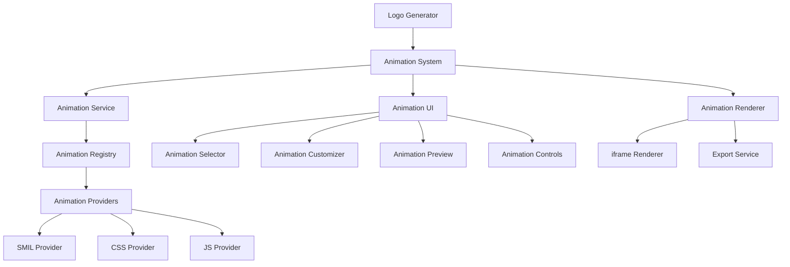

# SVG Logo Animation Architecture

## System Overview

The SVG Logo Animation system is designed as a modular, extensible architecture that enables the creation, customization, and rendering of animated logo variants. This document outlines the core components, their interactions, and the technical decisions that inform the implementation.



## Core Components

### 1. Animation Service

The Animation Service acts as the central coordination point for the animation system, providing a high-level API for applying animations to SVGs.

**Key Responsibilities:**

- Manage animation application to SVGs
- Coordinate between animation providers
- Handle animation validation and optimization
- Provide utilities for animation manipulation

**Technical Implementation:**

```typescript
export class AnimationService {
  private registry: AnimationRegistry;

  constructor(registry: AnimationRegistry) {
    this.registry = registry;
  }

  async applyAnimation(
    svg: string,
    animationType: AnimationType,
    options: AnimationOptions,
  ): Promise<AnimatedSVG> {
    const provider = this.registry.getProviderForType(animationType);
    const animatedSVG = await provider.animate(svg, options);
    return this.optimizeAnimation(animatedSVG);
  }

  private optimizeAnimation(animatedSVG: AnimatedSVG): AnimatedSVG {
    // Apply performance optimizations
    return animatedSVG;
  }

  // Additional methods for animation manipulation
}
```

### 2. Animation Registry

The Animation Registry maintains a catalog of available animations and their providers.

**Key Responsibilities:**

- Register animation types and their implementations
- Provide animations based on type or criteria
- Enable dynamic loading of animation providers
- Handle fallbacks for unsupported animations

**Technical Implementation:**

```typescript
export class AnimationRegistry {
  private providers: Map<AnimationType, AnimationProvider> = new Map();
  private fallbackProvider: AnimationProvider;

  registerProvider(type: AnimationType, provider: AnimationProvider): void {
    this.providers.set(type, provider);
  }

  getProviderForType(type: AnimationType): AnimationProvider {
    return this.providers.get(type) || this.fallbackProvider;
  }

  getAvailableAnimations(): Animation[] {
    // Return all registered animations
    return Array.from(this.providers.keys()).map((type) => ({
      type,
      metadata: this.providers.get(type)!.getMetadata(),
    }));
  }
}
```

### 3. Animation Providers

Animation Providers implement specific animation technologies (SMIL, CSS, JS) with a common interface.

**Key Responsibilities:**

- Implement technology-specific animation logic
- Generate necessary code for animations
- Handle browser compatibility concerns
- Provide metadata about supported features

**Technical Implementation:**

```typescript
// Common interface
export interface AnimationProvider {
  animate(svg: string, options: AnimationOptions): Promise<AnimatedSVG>;
  getMetadata(): AnimationMetadata;
  supportsFeature(feature: AnimationFeature): boolean;
}

// SMIL Implementation
export class SMILAnimationProvider implements AnimationProvider {
  animate(svg: string, options: AnimationOptions): Promise<AnimatedSVG> {
    // Apply SMIL-based animations to SVG
    return this.generateSMILAnimation(svg, options);
  }

  private generateSMILAnimation(
    svg: string,
    options: AnimationOptions,
  ): Promise<AnimatedSVG> {
    // SMIL-specific implementation
  }

  getMetadata(): AnimationMetadata {
    return {
      name: "SMIL Animation Provider",
      supportedFeatures: ["path", "transform", "color", "opacity"],
      browserSupport: ["chrome", "firefox", "safari"],
    };
  }

  supportsFeature(feature: AnimationFeature): boolean {
    return this.getMetadata().supportedFeatures.includes(feature);
  }
}

// Similar implementations for CSS and JS providers
```

### 4. Animation Renderer

The Animation Renderer displays animated SVGs in a controlled, isolated environment.

**Key Responsibilities:**

- Render animated SVGs safely
- Handle animation playback controls
- Provide preview capabilities
- Enable export in various formats

**Technical Implementation:**

```typescript
export class AnimationRenderer {
  private container: HTMLElement;
  private iframeRef: HTMLIFrameElement;

  constructor(container: HTMLElement) {
    this.container = container;
    this.setupIframe();
  }

  private setupIframe(): void {
    this.iframeRef = document.createElement("iframe");
    this.iframeRef.style.border = "none";
    this.iframeRef.style.width = "100%";
    this.iframeRef.style.height = "100%";
    this.container.appendChild(this.iframeRef);
  }

  render(animatedSVG: AnimatedSVG): void {
    const { svg, css, js } = animatedSVG;
    const doc = this.iframeRef.contentDocument!;

    doc.open();
    doc.write(`
      <!DOCTYPE html>
      <html>
      <head>
        <style>${css}</style>
      </head>
      <body>
        <div class="animation-container">${svg}</div>
        ${js ? `<script>${js}</script>` : ""}
      </body>
      </html>
    `);
    doc.close();
  }

  play(): void {
    // Control animation playback
  }

  pause(): void {
    // Pause animation
  }

  reset(): void {
    // Reset animation to initial state
  }
}
```

### 5. Animation UI Components

A set of React components for interacting with the animation system.

**Key Components:**

- **AnimationSelector**: UI for choosing animation types
- **AnimationCustomizer**: Interface for adjusting parameters
- **AnimationPreview**: Real-time preview with controls
- **AnimationExport**: Options for exporting animated assets

**Technical Implementation:**

```typescript
// Animation Selector Component
export const AnimationSelector: React.FC<AnimationSelectorProps> = ({
  animations,
  selectedAnimation,
  onSelect,
}) => {
  return (
    <div className="animation-selector">
      <h3>Choose Animation Style</h3>
      <div className="animation-grid">
        {animations.map(animation => (
          <div
            key={animation.type}
            className={`animation-item ${selectedAnimation === animation.type ? 'selected' : ''}`}
            onClick={() => onSelect(animation.type)}
          >
            <div className="animation-preview">
              {/* Mini preview of animation */}
            </div>
            <div className="animation-info">
              <h4>{animation.metadata.name}</h4>
              <p>{animation.metadata.description}</p>
            </div>
          </div>
        ))}
      </div>
    </div>
  );
};

// Similar implementations for other UI components
```

## Data Model

### Animation Types

```typescript
export enum AnimationType {
  // Basic Animations
  FADE_IN = "fade-in",
  FADE_OUT = "fade-out",
  SCALE = "scale",
  ROTATE = "rotate",
  TRANSLATE = "translate",
  PATH_DRAW = "path-draw",
  COLOR_TRANSITION = "color-transition",

  // Composite Animations
  LOGO_REVEAL = "logo-reveal",
  PULSE = "pulse",
  BOUNCE = "bounce",
  SPIN = "spin",
  WAVE = "wave",
  MORPH = "morph",

  // Interactive Animations
  HOVER_EFFECT = "hover-effect",
  CLICK_REACTION = "click-reaction",
  SCROLL_TRIGGERED = "scroll-triggered",
  CURSOR_FOLLOW = "cursor-follow",
}
```

### Animation Options

```typescript
export interface AnimationOptions {
  // General options
  duration: number;
  delay: number;
  easing: EasingFunction;
  iterations: number;
  direction: "normal" | "reverse" | "alternate" | "alternate-reverse";
  fillMode: "none" | "forwards" | "backwards" | "both";

  // Animation-specific options
  fadeOptions?: FadeOptions;
  scaleOptions?: ScaleOptions;
  rotateOptions?: RotateOptions;
  translateOptions?: TranslateOptions;
  pathOptions?: PathOptions;
  colorOptions?: ColorOptions;

  // Target options
  elementSelector?: string;
  applyToAll?: boolean;

  // Interactive options
  trigger?: "auto" | "hover" | "click" | "scroll" | "visibility";

  // Export options
  includeJS?: boolean;
  optimizeForWeb?: boolean;
}

// Animation-specific option interfaces
export interface FadeOptions {
  startOpacity: number;
  endOpacity: number;
}

export interface ScaleOptions {
  startScale: number;
  endScale: number;
  originX: number;
  originY: number;
}

// Additional option interfaces for other animation types
```

### Animated SVG Output

```typescript
export interface AnimatedSVG {
  svg: string;
  css: string;
  js?: string;
  metadata: {
    animationType: AnimationType;
    options: AnimationOptions;
    performance: {
      complexity: number;
      estimatedCPUUsage: number;
      browserCompatibility: Record<string, boolean>;
    };
  };
}
```

## Technical Considerations

### Performance Optimization

1. **SVG Element Reduction**

   - Simplify paths before animation
   - Group similar elements
   - Reduce unnecessary nested groups

2. **Animation Technique Selection**

   - Use CSS transforms when possible (GPU-accelerated)
   - Prefer SMIL for path animations
   - Use JavaScript only when necessary

3. **Rendering Optimizations**
   - Use requestAnimationFrame for JS animations
   - Implement animation throttling
   - Optimize repaints and reflows

### Browser Compatibility

1. **Feature Detection**

   - Detect animation support at runtime
   - Provide appropriate fallbacks

2. **Polyfills**

   - Include SMIL polyfill for browsers without native support
   - Use CSS @supports for feature-specific implementations

3. **Fallback Strategy**
   - Implement graceful degradation
   - Provide static alternatives

### Security Considerations

1. **SVG Sanitization**

   - Remove potential XSS vectors
   - Sanitize all user-influenced content

2. **Iframe Sandboxing**

   - Use appropriate sandbox attributes
   - Restrict unnecessary permissions

3. **Content Security Policy**
   - Implement strict CSP for animation content
   - Prevent inline script execution when possible

## Extension Points

The architecture is designed with several extension points:

1. **New Animation Types**

   - Register additional animation types in the registry
   - Implement corresponding providers

2. **Alternative Providers**

   - Create providers for new animation technologies
   - Replace existing providers with optimized versions

3. **Custom Renderers**

   - Implement specialized renderers for different contexts
   - Create export renderers for various formats

4. **Animation Middleware**
   - Insert processing steps between animation creation and rendering
   - Implement cross-cutting concerns like logging or analytics

## Implementation Roadmap

1. **Foundation** (Weeks 1-2)

   - Core interfaces and types
   - Basic service implementation
   - Simple provider implementation

2. **Core Features** (Weeks 3-5)

   - Complete provider implementations
   - Basic UI components
   - Integration with logo generation pipeline

3. **Enhanced Features** (Weeks 6-9)

   - Advanced animation types
   - UI refinement
   - Performance optimizations

4. **Polish & Launch** (Weeks 10-14)
   - Cross-browser testing
   - Documentation
   - Performance tuning
