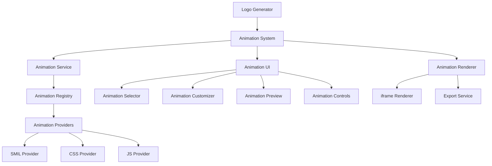

# ADR 008: Animation System Architecture

## Status

Accepted

## Context

The AI Logo Generator currently produces static SVG logos. To enhance the value of generated assets for digital applications, we need to implement a system for creating animated versions of logos. This requires a robust architecture that handles different animation technologies, provides customization options, and ensures performance and security.

## Decision

We will implement a modular animation system with the following components:

1. **Animation Service**: Central coordination point for applying animations to SVGs
2. **Animation Registry**: Catalog of available animations and providers
3. **Animation Providers**: Technology-specific implementations (SMIL, CSS, JS)
4. **Animation Renderer**: Isolated environment for displaying and controlling animations
5. **Animation UI**: Components for selection, customization, and preview

The system will use an iframe-based rendering approach for security and isolation, with a standardized interface for animation providers to ensure extensibility.

## Architecture



## Implementation Details

### Animation Service Interface

```typescript
export interface AnimationService {
  applyAnimation(
    svg: string,
    animationType: AnimationType,
    options: AnimationOptions,
  ): Promise<AnimatedSVG>;

  getAvailableAnimations(): Animation[];

  validateOptions(
    animationType: AnimationType,
    options: AnimationOptions,
  ): ValidationResult;

  exportAnimation(
    animatedSVG: AnimatedSVG,
    format: ExportFormat,
    options: ExportOptions,
  ): Promise<ExportResult>;
}
```

### Animation Provider Interface

```typescript
export interface AnimationProvider {
  animate(svg: string, options: AnimationOptions): Promise<AnimatedSVG>;
  getMetadata(): AnimationMetadata;
  supportsFeature(feature: AnimationFeature): boolean;
}
```

## Consequences

### Positive

- **Modular Design**: Easy to add new animation types and technologies
- **Security**: Isolated rendering prevents SVG injection vulnerabilities
- **Performance**: Appropriate animation technology selected based on complexity
- **User Experience**: Consistent interface regardless of underlying technology
- **Browser Compatibility**: Fallback mechanisms for older browsers

### Negative

- **Complexity**: More complex than direct DOM manipulation
- **Performance Overhead**: Iframe-based isolation adds some performance cost
- **Development Effort**: Requires implementing multiple providers

## Alternatives Considered

1. **Direct DOM Manipulation**: Simpler but less secure and more browser-dependent
2. **WebGL-based Animation**: Better performance but excessive complexity for logo animations
3. **Lottie Integration**: Good for complex animations but less suitable for SVG logos
4. **Single Technology Approach**: Using only CSS or only SMIL would be simpler but less flexible

## Implementation Plan

1. **Phase 1: Foundation** (4 weeks)

   - Core interfaces and types
   - Basic service and registry
   - SMIL and CSS providers

2. **Phase 2: Core Features** (6 weeks)

   - Complete all providers
   - Basic UI components
   - Integration with pipeline

3. **Phase 3: Enhanced Features** (8 weeks)

   - Advanced animation types
   - UI refinements
   - Performance optimization

4. **Phase 4: Production** (4 weeks)
   - Cross-browser testing
   - Documentation
   - Performance tuning
