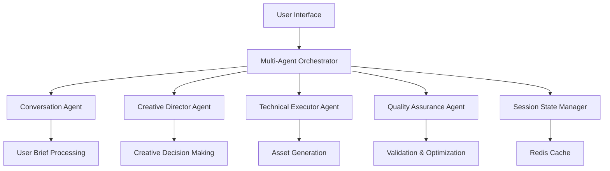

# ADR 009: Multi-Agent Orchestration Architecture

## Status

Accepted

## Context

The current logo generation system uses a pipeline-based approach with sequential stages. While functional, this approach limits the system's ability to make context-aware decisions, handle complex requirements, and provide a natural conversation flow. As we expand to more comprehensive brand asset generation, we need a more sophisticated architecture.

## Decision

We will transition from the pipeline-based architecture to a multi-agent orchestration system. This system will consist of specialized AI agents that handle different aspects of the logo generation process, coordinated by a central orchestrator.

## Architecture



## Agent Specifications

1. **Conversation Agent**

   - Model: Claude 3.5 Haiku
   - Purpose: Natural language understanding and user guidance
   - Responsibilities: Extract requirements, ask clarifying questions, maintain conversation context

2. **Creative Director Agent**

   - Model: Claude 3.5 Sonnet
   - Purpose: Style and creative decisions
   - Responsibilities: Mood board creation, concept selection, style guidance

3. **Technical Executor Agent**

   - Model: Claude 3.5 Sonnet
   - Purpose: Asset generation and processing
   - Responsibilities: SVG generation, variant creation, animation application

4. **Quality Assurance Agent**
   - Model: Claude 3.5 Haiku
   - Purpose: Validation and optimization
   - Responsibilities: SVG validation, accessibility checking, optimization

## Implementation Details

### Agent Coordinator Interface

```typescript
interface AgentCoordinator {
  // Core orchestration engine
  orchestrator: MultiAgentOrchestrator;

  // Specialized agent instances
  agents: {
    conversationAgent: ConversationAgent; // Natural language understanding
    creativeDirector: CreativeDirectorAgent; // Style and creative decisions
    technicalExecutor: TechnicalExecutorAgent; // Asset generation and processing
    qualityAssurance: QualityAssuranceAgent; // Validation and optimization
  };

  // State management
  sessionState: AgentSessionState;
  userContext: UserContextProfile;
  projectState: BrandProjectState;
}
```

### State Management

```typescript
interface AgentSessionState {
  conversationHistory: Message[];
  currentStage: GenerationStage;
  progress: {
    stage: string;
    percentage: number;
    estimatedTimeRemaining: number;
  };
  generationResults: {
    concepts: Concept[];
    selectedConcept: Concept | null;
    logo: SVGLogo | null;
    variants: LogoVariants | null;
    animations: AnimatedLogo[] | null;
    webDesigns: WebDesign[] | null;
    guidelines: BrandGuidelines | null;
    package: AssetPackage | null;
  };
}
```

## Consequences

### Positive

- **Natural Conversation Flow**: More intuitive user interaction
- **Context-Aware Decisions**: Better understanding of user requirements
- **Specialized Expertise**: Each agent can excel at its specific task
- **Flexible Workflow**: Non-linear process that can adapt to user needs
- **Extensibility**: Easy to add new agent types for additional capabilities

### Negative

- **Increased Complexity**: More moving parts than a pipeline
- **State Management Challenges**: Need to maintain consistent state across agents
- **Higher Resource Usage**: Multiple models running concurrently
- **Potential for Inconsistency**: Different agents might make conflicting decisions
- **Development Effort**: Significant rewrite of core architecture

## Alternatives Considered

1. **Enhanced Pipeline**: Add more context-awareness to the existing pipeline
2. **Single Large Agent**: Use one large model for all tasks
3. **Function Calling Approach**: Use function calling instead of separate agents
4. **Human-in-the-Loop**: Hybrid system with human guidance for key decisions

## Implementation Plan

1. **Phase 1: Architecture Design** (4 weeks)

   - Define agent communication protocols
   - Design state management system
   - Create agent interfaces

2. **Phase 2: Core Agent Implementation** (8 weeks)

   - Implement conversation and creative director agents
   - Develop technical executor agent
   - Create quality assurance agent

3. **Phase 3: Orchestration System** (6 weeks)

   - Build multi-agent orchestrator
   - Implement state management with Redis
   - Create fallback mechanisms

4. **Phase 4: Testing & Optimization** (4 weeks)
   - End-to-end testing
   - Performance optimization
   - Scalability testing
