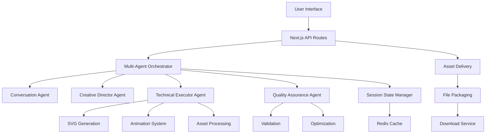
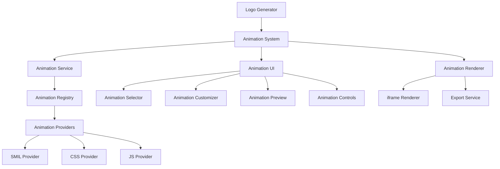

# Technical Requirements Document

## AI Logo Generator: Multi-Agent Creative Platform

### Document Information

| Field            | Value                       |
| ---------------- | --------------------------- |
| Document Version | 2.0                         |
| Last Updated     | June 17, 2025               |
| Author           | Technical Architecture Team |

## 1. System Architecture

### 1.1. High-Level Architecture

The system is designed as a modern web application with a multi-agent AI backend, leveraging Next.js for the frontend and API routes, with Claude models for AI generation.



### 1.2. Technology Stack

#### Frontend

- **Framework**: Next.js 15 (App Router)
- **UI Library**: React 19
- **Styling**: Tailwind CSS 4 with custom design system
- **State Management**: Zustand (planned)
- **Animation**: Framer Motion + custom animation system

#### Backend

- **Runtime**: Node.js 18+ with TypeScript
- **API Framework**: Next.js API routes with edge functions
- **AI Models**: Anthropic Claude 3.5 (Sonnet, Haiku)
- **Image Processing**: Sharp.js for SVG/PNG manipulation
- **File Handling**: JSZip for package assembly

#### Infrastructure

- **Hosting**: Vercel with edge function deployment
- **CDN**: Vercel Edge Network
- **Caching**: Redis (planned)
- **Monitoring**: Sentry, Vercel Analytics

## 2. Multi-Agent Architecture

### 2.1. Agent System Overview

The application transitions from a pipeline-based architecture to a multi-agent system where specialized agents handle different aspects of the logo generation process.

#### Agent Coordinator

```typescript
interface AgentCoordinator {
  // Core orchestration engine
  orchestrator: MultiAgentOrchestrator;

  // Specialized agent instances
  agents: {
    conversationAgent: ConversationAgent; // Natural language understanding
    creativeDirector: CreativeDirectorAgent; // Style and creative decisions
    technicalExecutor: TechnicalExecutorAgent; // Asset generation and processing
    qualityAssurance: QualityAssuranceAgent; // Validation and optimization
  };

  // State management
  sessionState: AgentSessionState;
  userContext: UserContextProfile;
  projectState: BrandProjectState;
}
```

### 2.2. Agent Specifications

#### Conversation Agent

- **Model**: Claude 3.5 Haiku
- **Purpose**: Natural language understanding and user guidance
- **Responsibilities**:
  - Parse user requirements from natural language
  - Ask clarifying questions to build complete brief
  - Maintain conversation context across session
  - Guide user through decision points

#### Creative Director Agent

- **Model**: Claude 3.5 Sonnet
- **Purpose**: Creative decision making and style guidance
- **Responsibilities**:
  - Generate concept directions based on requirements
  - Make style decisions based on industry and preferences
  - Select optimal concepts for further development
  - Ensure brand consistency across assets

#### Technical Executor Agent

- **Model**: Claude 3.5 Sonnet
- **Purpose**: Asset generation and processing
- **Responsibilities**:
  - Generate SVG logo based on creative direction
  - Create variants (monochrome, simplified, etc.)
  - Apply animations to logos
  - Produce rasterized versions in various formats

#### Quality Assurance Agent

- **Model**: Claude 3.5 Haiku
- **Purpose**: Validation and optimization
- **Responsibilities**:
  - Validate generated SVGs for technical correctness
  - Check accessibility compliance
  - Optimize assets for performance
  - Verify brand consistency

### 2.3. State Management

```typescript
interface AgentSessionState {
  conversationHistory: Message[];
  currentStage: GenerationStage;
  progress: {
    stage: string;
    percentage: number;
    estimatedTimeRemaining: number;
  };
  generationResults: {
    concepts: Concept[];
    selectedConcept: Concept | null;
    logo: SVGLogo | null;
    variants: LogoVariants | null;
    animations: AnimatedLogo[] | null;
    webDesigns: WebDesign[] | null;
    guidelines: BrandGuidelines | null;
    package: AssetPackage | null;
  };
}
```

## 3. Animation System Architecture

### 3.1. System Overview



### 3.2. Animation Service Interface

```typescript
export interface AnimationService {
  // Apply animation to SVG
  applyAnimation(
    svg: string,
    animationType: AnimationType,
    options: AnimationOptions,
  ): Promise<AnimatedSVG>;

  // Get available animations
  getAvailableAnimations(): Animation[];

  // Validate animation options
  validateOptions(
    animationType: AnimationType,
    options: AnimationOptions,
  ): ValidationResult;

  // Export animation to different formats
  exportAnimation(
    animatedSVG: AnimatedSVG,
    format: ExportFormat,
    options: ExportOptions,
  ): Promise<ExportResult>;
}
```

### 3.3. Animation Provider Interface

```typescript
export interface AnimationProvider {
  // Apply animation to SVG
  animate(svg: string, options: AnimationOptions): Promise<AnimatedSVG>;

  // Get provider metadata
  getMetadata(): AnimationMetadata;

  // Check feature support
  supportsFeature(feature: AnimationFeature): boolean;
}
```

### 3.4. Animation Types

```typescript
export enum AnimationType {
  // Basic Animations
  FADE_IN = "fade-in",
  FADE_OUT = "fade-out",
  SCALE = "scale",
  ROTATE = "rotate",
  TRANSLATE = "translate",
  PATH_DRAW = "path-draw",
  COLOR_TRANSITION = "color-transition",

  // Composite Animations
  LOGO_REVEAL = "logo-reveal",
  PULSE = "pulse",
  BOUNCE = "bounce",
  SPIN = "spin",
  WAVE = "wave",
  MORPH = "morph",

  // Interactive Animations
  HOVER_EFFECT = "hover-effect",
  CLICK_REACTION = "click-reaction",
  SCROLL_TRIGGERED = "scroll-triggered",
  CURSOR_FOLLOW = "cursor-follow",
}
```

## 4. Web Design Generation System

### 4.1. Web Design Engine Interface

```typescript
interface WebDesignEngine {
  // Competitive research
  searchAwardWinningWebsites(industry: string): Promise<WebsiteReference[]>;

  // Design analysis
  analyzeDesignElements(websites: WebsiteReference[]): Promise<DesignAnalysis>;

  // Synthesis and generation
  synthesizeDesignConcepts(
    analysis: DesignAnalysis,
    brandProfile: BrandProfile,
  ): Promise<WebDesignConcept[]>;

  // Code generation
  generateWebsiteCode(concept: WebDesignConcept): Promise<WebsiteAssets>;
}
```

### 4.2. Design Analysis Model

```typescript
interface DesignAnalysis {
  typography: {
    primaryFonts: FontAnalysis[];
    headingStyles: TypographyStyle[];
    bodyTextStyles: TypographyStyle[];
    fontPairings: FontPairing[];
  };

  colorSchemes: {
    primaryPalette: ColorPalette;
    accentColors: string[];
    backgroundStyles: BackgroundStyle[];
    colorHarmonies: ColorHarmony[];
  };

  layoutPatterns: {
    gridSystems: GridSystem[];
    sectionLayouts: SectionLayout[];
    navigationStyles: NavigationStyle[];
    containerStyles: ContainerStyle[];
  };

  imageStyles: {
    photographyStyle: ImageStyle;
    illustrationStyle: ImageStyle;
    iconography: IconStyle;
    imageRatios: AspectRatio[];
  };

  interactionPatterns: {
    animations: AnimationPattern[];
    hoverEffects: HoverEffect[];
    scrollBehaviors: ScrollBehavior[];
    microInteractions: MicroInteraction[];
  };
}
```

## 5. Data Models

### 5.1. Core Data Models

#### Logo Brief

```typescript
interface LogoBrief {
  // User input
  brandName: string;
  brandDescription: string;
  industry?: string;
  targetAudience?: string;
  stylePreferences?: string;
  colorPreferences?: string;
  referenceImages?: ImageInput[];

  // System options
  includeVariants: boolean;
  includeGuidelines: boolean;
  includeAnimations: boolean;
  includeWebDesign: boolean;
}
```

#### SVG Logo

```typescript
interface SVGLogo {
  svg: string;
  width: number;
  height: number;
  viewBox: string;
  elements: SVGElement[];
  colors: string[];
  metadata: {
    generationModel: string;
    generationTime: number;
    designScore: number;
  };
}
```

#### Logo Variants

```typescript
interface LogoVariants {
  primary: SVGLogo;
  monochrome: {
    black: SVGLogo;
    white: SVGLogo;
  };
  simplified: SVGLogo;
  favicon: SVGLogo;
  png: {
    small: Blob; // 256px
    medium: Blob; // 512px
    large: Blob; // 1024px
    transparent: {
      small: Blob;
      medium: Blob;
      large: Blob;
    };
  };
}
```

#### Animated Logo

```typescript
interface AnimatedLogo {
  svg: string;
  css: string;
  js?: string;
  animationType: AnimationType;
  options: AnimationOptions;
  preview: string; // Data URL
}
```

### 5.2. Web Design Models

```typescript
interface WebDesign {
  concept: WebDesignConcept;
  assets: WebsiteAssets;
  preview: {
    desktop: string; // Image URL
    mobile: string; // Image URL
    tablet: string; // Image URL
  };
}

interface WebsiteAssets {
  html: string;
  css: string;
  javascript: string;
  responsive: string; // Responsive CSS
  components: Record<string, string>; // Component code
  assets: {
    fonts: string[];
    images: string[];
    icons: string[];
  };
  framework?: {
    react?: Record<string, string>;
    nextjs?: Record<string, string>;
    tailwind?: Record<string, string>;
  };
}
```

## 6. API Specifications

### 6.1. API Endpoints

#### Generate Logo API

```typescript
// POST /api/generate-logo
interface GenerateLogoRequest {
  brief: LogoBrief;
  options?: {
    priority?: "quality" | "speed";
    modelVersion?: string;
    maxGenerationTime?: number;
  };
}

interface GenerateLogoResponse {
  requestId: string;
  status: "pending" | "processing" | "completed" | "failed";
  progress?: {
    stage: string;
    percentage: number;
    estimatedTimeRemaining: number;
  };
  results?: {
    logoSvg: string;
    variants: LogoVariants;
    guidelines?: BrandGuidelines;
    animations?: AnimatedLogo[];
    webDesign?: WebDesign;
  };
  error?: {
    code: string;
    message: string;
    details?: any;
  };
}
```

#### Animation API

```typescript
// POST /api/animate-logo
interface AnimateLogoRequest {
  svg: string;
  animationType: AnimationType;
  options: AnimationOptions;
}

interface AnimateLogoResponse {
  status: "success" | "failed";
  animatedSvg?: AnimatedLogo;
  error?: {
    code: string;
    message: string;
    details?: any;
  };
}
```

#### Web Design API

```typescript
// POST /api/generate-web-design
interface GenerateWebDesignRequest {
  brandProfile: BrandProfile;
  logo: SVGLogo;
  requirements: WebsiteRequirements;
}

interface GenerateWebDesignResponse {
  status: "success" | "failed";
  webDesign?: WebDesign;
  error?: {
    code: string;
    message: string;
    details?: any;
  };
}
```

### 6.2. Streaming API

The system uses Server-Sent Events (SSE) for real-time progress updates during the generation process:

```typescript
// GET /api/generation-progress/:requestId
// Event stream format:
interface ProgressEvent {
  type: "progress";
  data: {
    stage: string;
    percentage: number;
    estimatedTimeRemaining: number;
    message?: string;
  };
}

interface CompletionEvent {
  type: "complete";
  data: {
    downloadUrl: string;
  };
}

interface ErrorEvent {
  type: "error";
  data: {
    code: string;
    message: string;
    recoverable: boolean;
  };
}
```

## 7. Security Requirements

### 7.1. Input Validation

All user inputs must be sanitized to prevent injection attacks:

```typescript
// Example sanitization for user prompts
const sanitizePrompt = (input: string): string => {
  // Remove potential injection patterns
  const dangerous = [
    /ignore\s+previous\s+instructions/gi,
    /system\s*:/gi,
    /assistant\s*:/gi,
    /<script.*?>/gi,
    /javascript:/gi,
  ];

  let cleaned = input;
  dangerous.forEach((pattern) => {
    cleaned = cleaned.replace(pattern, "[REMOVED]");
  });

  return cleaned.slice(0, 2000); // Limit length
};
```

### 7.2. SVG Security

Generated SVGs must be scanned for potential security vulnerabilities:

```typescript
const securityChecks = {
  disallowedElements: ["script", "foreignObject", "use"],
  disallowedAttributes: ["onload", "onclick", "onerror"],
  disallowedProtocols: ["javascript:", "data:text/html"],
  maxFileSize: 15 * 1024, // 15KB
};
```

### 7.3. API Protection

- Rate limiting: 10 requests per 15 minutes per IP
- Authentication: JWT-based for future premium features
- CORS: Restricted to allowed domains
- Input size limits: Maximum file size 10MB, text input 2000 characters

## 8. Performance Requirements

### 8.1. Response Time Targets

- API response time: < 500ms (95th percentile)
- Logo generation time: < target seconds
- Animation rendering: < 150ms per frame
- Web design generation: < 5 minutes

### 8.2. Scalability

- Support for 100+ concurrent generations
- Auto-scaling based on demand
- Queue management for peak periods

### 8.3. Caching Strategy

```typescript
// Cache identical briefs for 1 hour
const cacheKey = crypto
  .createHash("sha256")
  .update(JSON.stringify({ brief, options }))
  .digest("hex");
```

## 9. Testing Strategy

### 9.1. Unit Testing

- Framework: Vitest
- Coverage target: 80%+ for core services
- Focus areas: Service logic, data transformations, security checks

### 9.2. Integration Testing

- API endpoint testing with mocked AI responses
- Multi-agent orchestration flow testing
- Error handling and recovery testing

### 9.3. UI Testing

- Component tests with React Testing Library
- Visual regression testing with Playwright
- Accessibility testing with axe-core

### 9.4. Performance Testing

- Load testing with k6
- Performance budgets with Lighthouse
- Animation performance benchmarking

## 10. Monitoring and Observability

### 10.1. Error Tracking

- Sentry for frontend and backend error reporting
- Custom error categorization
- User impact tracking

### 10.2. Performance Monitoring

- Core Web Vitals tracking
- API response time monitoring
- Generation success rate tracking
- Cost per generation monitoring

### 10.3. User Analytics

- Conversion funnel analysis
- Feature usage tracking
- User satisfaction metrics
- A/B testing framework

## 11. Development Environment

### 11.1. Local Development

- Node.js 18+
- npm package manager
- Next.js development server
- Local environment variables

### 11.2. CI/CD Pipeline

- GitHub Actions for automated testing
- Vercel for preview deployments
- Automated visual regression testing
- Pre-commit hooks for code quality

## 12. Accessibility Requirements

- WCAG 2.1 AA compliance
- Screen reader compatibility
- Keyboard navigation support
- Color contrast requirements
- Animation control options (reduce motion)

## 13. Internationalization

- Future support for multiple languages
- RTL layout support
- Unicode handling for brand names
- Localized error messages

## 14. Appendix

### 14.1. Glossary

- SVG: Scalable Vector Graphics
- SMIL: Synchronized Multimedia Integration Language
- SSE: Server-Sent Events
- JWT: JSON Web Token
- WCAG: Web Content Accessibility Guidelines

### 14.2. References

- Anthropic Claude API Documentation
- Next.js Documentation
- Sharp.js Documentation
- WCAG 2.1 Guidelines
